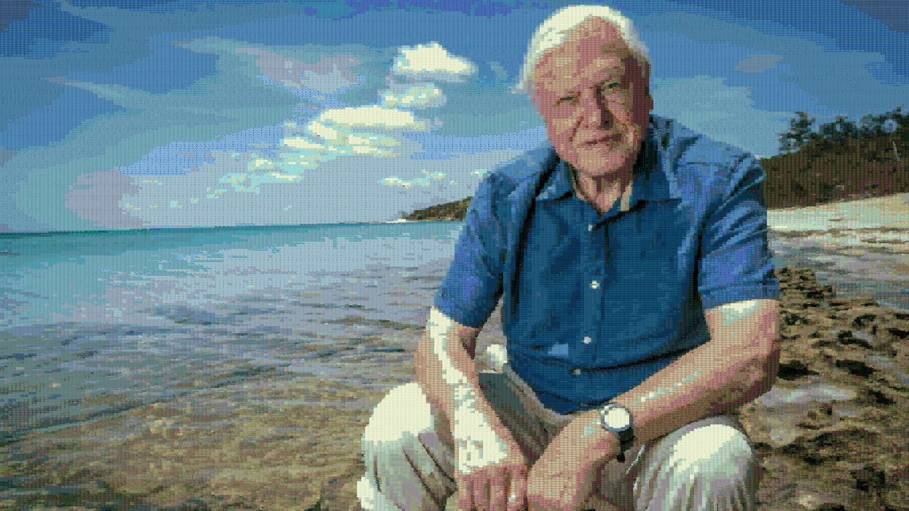

# **Photo Mosaic**
Generated a photo mosaic of _Sir David Attenborough's_ potrait by sampling frames from the episodes of the series _Life on Earth_
**Approach :**

* Sampled frames evenly from each episode 
* Used Haar cascade for detecting faces
* Replacing each pixel of the reference potrait with the frame that has the closest average intensity to that of the pixel.
* Applied weightage to the facial images so that they appear more in the result

As the sampling is random, I had to use large number of frames per row/column for good appearance

This is the downsampled version of the result, for the original result with full resolution, download other two final versions
